# Enhanced Virtual Cell Architecture

```mermaid
graph TB
    %% Input Processing with Hierarchical Organization
    subgraph Input["Enhanced Input Processing"]
        PE[Protein Embeddings<br/>E in R N x token_dim]
        CLS[CLS Token<br/>theta_cls in R token_dim]
        DS[Dataset Token<br/>theta_ds in R token_dim]
        CNT[Count Values<br/>c in R N]
        PATH[Pathway Annotations<br/>P in R N x pathway_dim]
        COMP[Compartment Info<br/>C in R N x comp_dim]
    end
    
    %% Hierarchical Gene Organization
    subgraph Hierarchical["Hierarchical Gene Organization"]
        PATH_ATTN[Pathway-Level Attention<br/>Groups genes by biological pathways]
        GENE_ATTN[Gene-Level Attention<br/>Within-pathway interactions]
        COMP_EMB[Compartment Embeddings<br/>Nucleus, Cytoplasm, Membrane, etc.]
    end
    
    %% Multi-Scale Processing
    subgraph MultiScale["Multi-Scale Biological Processing"]
        MOL[Molecular Scale<br/>Individual gene expression]
        PATH_SCALE[Pathway Scale<br/>Coordinated gene sets]
        CELL_SCALE[Cellular Scale<br/>Global cellular state]
        CROSS_SCALE[Cross-Scale Attention<br/>Information flow between scales]
    end
    
    %% Temporal Dynamics
    subgraph Temporal["Temporal Cellular Dynamics"]
        FAST[Fast Response LSTM<br/>Immediate gene responses]
        SLOW[Slow Response LSTM<br/>Delayed gene responses]
        TEMP_ATTN[Temporal Attention<br/>Time-dependent interactions]
        FEEDBACK[Feedback Loops<br/>Cellular response regulation]
    end
    
    %% Regulatory Network Constraints
    subgraph Regulatory["Biologically Constrained Attention"]
        INTERACT[Gene Interaction Matrix<br/>Known biological constraints]
        MASK_ATTN[Masked Attention<br/>Enforces regulatory topology]
        DIRECTION[Directional Interactions<br/>TF → Target relationships]
    end
    
    %% Cellular Memory
    subgraph Memory["Cellular Memory System"]
        MEM_BANK[Epigenetic Memory Bank<br/>Previous perturbation history]
        MEM_RET[Memory Retrieval<br/>Attention-based memory access]
        MEM_UPD[Memory Update<br/>Learning from new experiences]
    end
    
    %% Stochastic Behavior
    subgraph Stochastic["Stochastic Cellular Behavior"]
        NOISE_ENC[Noise Encoder<br/>Learns cellular variability]
        STOCH_DEC[Stochastic Decoder<br/>Generates diverse responses]
        HETERO[Heterogeneous Responses<br/>Cell-to-cell variability]
    end
    
    %% Resource Constraints
    subgraph Resources["Resource-Constrained Processing"]
        RES_TRACK[Resource Tracker<br/>Energy and resource state]
        RES_ATTN[Resource-Aware Attention<br/>Competition for resources]
        RES_ALLOC[Resource Allocator<br/>Optimal resource distribution]
    end
    
    %% Enhanced Transformer Stack
    subgraph EnhancedTransformer["Enhanced Flash Transformer Stack"]
        direction TB
        ET1[Biologically-Constrained Layer 1]
        ET2[Biologically-Constrained Layer 2]
        ETDOTS[...]
        ETN[Biologically-Constrained Layer nlayers]
        
        ET1 --> ET2
        ET2 --> ETDOTS
        ETDOTS --> ETN
    end
    
    %% Enhanced Decoder with Memory
    subgraph EnhancedDecoder["Enhanced Decoder with Memory"]
        MEM_INT[Memory Integration<br/>Incorporates cellular memory]
        SB1[SkipBlock with Memory<br/>R d_model to R d_model]
        LIN2[Linear with Stochasticity<br/>R d_model to R output_dim]
    end
    
    %% Multi-Task Outputs
    subgraph Outputs["Multi-Task Cellular Outputs"]
        EMB[State Embedding<br/>e in R output_dim]
        PRED[Perturbation Prediction<br/>p in R 1]
        TEMP_PRED[Temporal Predictions<br/>t in R time_steps x output_dim]
        CONF[Confidence Scores<br/>c in R 1]
        RES_STATE[Resource State<br/>r in R resource_dim]
    end
    
    %% Main Flow
    PE --> PATH_ATTN
    CLS --> PATH_ATTN
    DS --> PATH_ATTN
    PATH --> PATH_ATTN
    COMP --> COMP_EMB
    
    PATH_ATTN --> GENE_ATTN
    GENE_ATTN --> MOL
    COMP_EMB --> MOL
    
    MOL --> PATH_SCALE
    PATH_SCALE --> CELL_SCALE
    CELL_SCALE --> CROSS_SCALE
    
    CROSS_SCALE --> FAST
    CROSS_SCALE --> SLOW
    FAST --> TEMP_ATTN
    SLOW --> TEMP_ATTN
    TEMP_ATTN --> FEEDBACK
    
    FEEDBACK --> INTERACT
    INTERACT --> MASK_ATTN
    MASK_ATTN --> DIRECTION
    
    DIRECTION --> MEM_BANK
    MEM_BANK --> MEM_RET
    MEM_RET --> MEM_UPD
    
    MEM_UPD --> NOISE_ENC
    NOISE_ENC --> STOCH_DEC
    STOCH_DEC --> HETERO
    
    HETERO --> RES_TRACK
    RES_TRACK --> RES_ATTN
    RES_ATTN --> RES_ALLOC
    
    RES_ALLOC --> ET1
    ET1 --> ET2
    ET2 --> ETDOTS
    ETDOTS --> ETN
    
    ETN --> MEM_INT
    MEM_INT --> SB1
    SB1 --> LIN2
    
    %% Outputs
    LIN2 --> EMB
    LIN2 --> PRED
    TEMP_ATTN --> TEMP_PRED
    STOCH_DEC --> CONF
    RES_TRACK --> RES_STATE
    
    %% Styling
    classDef input fill:#e3f2fd
    classDef hierarchical fill:#f3e5f5
    classDef multiscale fill:#e8f5e8
    classDef temporal fill:#fff3e0
    classDef regulatory fill:#fce4ec
    classDef memory fill:#f1f8e9
    classDef stochastic fill:#fff8e1
    classDef resources fill:#e0f2f1
    classDef transformer fill:#e8eaf6
    classDef decoder fill:#fafafa
    classDef output fill:#ffebee
    
    class PE,CLS,DS,CNT,PATH,COMP input
    class PATH_ATTN,GENE_ATTN,COMP_EMB hierarchical
    class MOL,PATH_SCALE,CELL_SCALE,CROSS_SCALE multiscale
    class FAST,SLOW,TEMP_ATTN,FEEDBACK temporal
    class INTERACT,MASK_ATTN,DIRECTION regulatory
    class MEM_BANK,MEM_RET,MEM_UPD memory
    class NOISE_ENC,STOCH_DEC,HETERO stochastic
    class RES_TRACK,RES_ATTN,RES_ALLOC resources
    class ET1,ET2,ETDOTS,ETN transformer
    class MEM_INT,SB1,LIN2 decoder
    class EMB,PRED,TEMP_PRED,CONF,RES_STATE output
```

## Key Biological Improvements

### **1. Hierarchical Gene Organization**
- **Pathway-Level Processing**: Groups genes by biological pathways
- **Compartment Awareness**: Considers cellular location (nucleus, cytoplasm, etc.)
- **Functional Grouping**: Related genes processed together

### **2. Multi-Scale Biological Processing**
- **Molecular Scale**: Individual gene expression changes
- **Pathway Scale**: Coordinated changes in gene sets
- **Cellular Scale**: Global cellular state changes
- **Cross-Scale Integration**: Information flows between scales

### **3. Temporal Dynamics**
- **Fast Response**: Immediate gene responses (transcription factors)
- **Slow Response**: Delayed responses (structural proteins)
- **Feedback Loops**: Cellular response regulation
- **Time-Dependent Attention**: Considers temporal relationships

### **4. Biologically Constrained Attention**
- **Gene Interaction Matrix**: Uses known biological constraints
- **Masked Attention**: Enforces regulatory network topology
- **Directional Interactions**: Respects TF → Target relationships

### **5. Cellular Memory System**
- **Epigenetic Memory**: Remembers previous perturbations
- **Memory Retrieval**: Attention-based memory access
- **Memory Update**: Learns from new experiences

### **6. Stochastic Cellular Behavior**
- **Noise Encoder**: Learns cellular variability parameters
- **Stochastic Decoder**: Generates diverse responses
- **Heterogeneous Responses**: Cell-to-cell variability

### **7. Resource-Constrained Processing**
- **Resource Tracking**: Monitors energy and resource state
- **Resource-Aware Attention**: Considers resource competition
- **Resource Allocation**: Optimal distribution of limited resources

## Implementation Benefits

1. **Biological Realism**: More accurately models cellular processes
2. **Interpretability**: Attention weights reveal biological mechanisms
3. **Robustness**: Handles cellular variability and noise
4. **Scalability**: Hierarchical organization improves efficiency
5. **Memory**: Learns from previous perturbations
6. **Temporal Dynamics**: Captures time-dependent responses
7. **Resource Awareness**: Considers cellular constraints

## Expected Performance Improvements

- **Better Perturbation Prediction**: More accurate predictions due to biological constraints
- **Improved Generalization**: Memory system helps with unseen perturbations
- **Temporal Understanding**: Captures delayed and feedback responses
- **Cellular Variability**: Handles stochastic cellular behavior
- **Resource Efficiency**: More efficient processing through hierarchical organization
