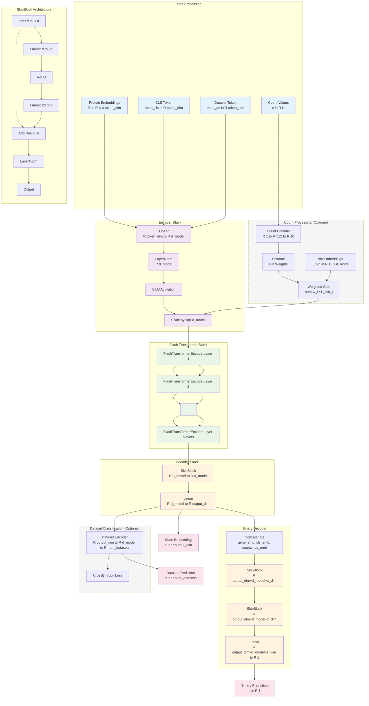

# State Embedding Model Architecture

## Architecture Components

### **Input Processing**
- **Protein Embeddings**: Pre-trained embeddings E ∈ R^(N×token_dim)
- **CLS Token**: Learnable parameter θ_cls ∈ R^token_dim
- **Dataset Token**: Optional learnable parameter θ_ds ∈ R^token_dim
- **Count Values**: Optional count data c ∈ R^N

### **Encoder Stack**
- **Linear Projection**: R^token_dim → R^d_model
- **Layer Normalization**: Pre-activation normalization
- **SiLU Activation**: Smooth ReLU variant
- **Scaling**: Multiply by √d_model (transformer standard)

### **Count Processing** (Optional)
- **Count Encoder**: 1D → 512D → 10D (soft binning)
- **Softmax**: Convert to bin probabilities
- **Bin Embeddings**: Learnable embeddings E_bin ∈ R^(10×d_model)
- **Weighted Sum**: Σ w_i * E_bin_i

### **Flash Transformer Stack**
- **nlayers** FlashTransformerEncoderLayer instances
- Each layer: Multi-head attention + FFN + residual connections
- Optimized for memory efficiency

### **SkipBlock Architecture**
- **Residual Connection**: x + f(x)
- **MLP**: d → 2d → d with ReLU
- **Layer Normalization**: Post-residual normalization

### **Decoder Stack**
- **SkipBlock**: R^d_model → R^d_model
- **Linear Projection**: R^d_model → R^output_dim

### **Binary Decoder**
- **Concatenation**: [gene_emb, cls_emb, counts, ds_emb]
- **Two SkipBlocks**: Processing concatenated features
- **Final Linear**: R^(output_dim+d_model+z_dim) → R^1

### **Dataset Classification** (Optional)
- **Dataset Encoder**: R^output_dim → R^d_model → R^num_datasets
- **CrossEntropy Loss**: Multi-class classification

## Key Design Decisions

1. **Pre-activation LayerNorm**: Applied before SiLU in encoder
2. **SiLU Activation**: Smooth ReLU for better gradients
3. **SkipBlock Pattern**: Residual connections with MLP expansion
4. **Flash Transformer**: Memory-efficient attention implementation
5. **Multi-task Learning**: Joint embedding + binary prediction + dataset classification
6. **Soft Binning**: Count data processed as probability distributions over bins
