# State Embedding Neural Network Architecture

```mermaid
graph TD
    %% Input Layer
    A[Input Tokens<br/>token_dim] --> B[Protein Embeddings<br/>pe_embedding]
    B --> C[Normalize<br/>L2 Normalization]
    C --> D[Add CLS Token<br/>Learnable Parameter]
    
    %% Optional Dataset Token
    D --> E{Has Dataset Token?}
    E -->|Yes| F[Add Dataset Token<br/>Learnable Parameter]
    E -->|No| G[Encoder Layer]
    F --> G
    
    %% Encoder
    G --> H[Linear Layer<br/>token_dim → d_model]
    H --> I[Layer Normalization]
    I --> J[SiLU Activation]
    
    %% Count Processing (Optional)
    J --> K{Has Counts?}
    K -->|Yes| L[Count Encoder<br/>1 → 512 → 10]
    L --> M[Softmax<br/>Bin Weights]
    M --> N[Bin Embeddings<br/>10 → d_model]
    N --> O[Weighted Sum<br/>Count Embeddings]
    O --> P[Add to Token Embeddings]
    K -->|No| Q[Transformer Encoder]
    P --> Q
    
    %% Transformer Encoder
    Q --> R[Flash Transformer<br/>nlayers × FlashTransformerEncoderLayer]
    R --> S[Decoder Input]
    
    %% Decoder
    S --> T[SkipBlock<br/>Residual + MLP + LayerNorm]
    T --> U[Linear Layer<br/>d_model → output_dim]
    
    %% Output Processing
    U --> V[Extract CLS Token<br/>gene_output slice 0]
    V --> W[L2 Normalize<br/>Final Embedding]
    
    %% Binary Decoder Path
    U --> X[Concatenate with<br/>Gene Embeddings + CLS + Counts + Dataset]
    X --> Y[SkipBlock 1<br/>Residual + MLP + LayerNorm]
    Y --> Z[SkipBlock 2<br/>Residual + MLP + LayerNorm]
    Z --> AA[Linear Layer<br/>→ 1 output]
    
    %% Dataset Classification (Optional)
    U --> BB{Has Dataset Token?}
    BB -->|Yes| CC[Extract Dataset Token<br/>gene_output slice -1]
    CC --> DD[Dataset Encoder<br/>output_dim → d_model → num_datasets]
    DD --> EE[Cross Entropy Loss<br/>Dataset Classification]
    
    %% SkipBlock Detail
    subgraph SkipBlock_Detail["SkipBlock Architecture"]
        direction TB
        SB1[Input] --> SB2[Linear: in_features → in_features×2]
        SB2 --> SB3[ReLU Activation]
        SB3 --> SB4[Linear: in_features×2 → in_features]
        SB4 --> SB5[Add Residual]
        SB5 --> SB6[Layer Normalization]
        SB6 --> SB7[Output]
    end
    
    %% Flash Transformer Detail
    subgraph FlashTransformer_Detail["Flash Transformer Layer"]
        direction TB
        FT1[Input] --> FT2[Multi-Head Attention<br/>nhead heads]
        FT2 --> FT3[Add & Norm]
        FT3 --> FT4[Feed Forward<br/>d_model → d_hid → d_model]
        FT4 --> FT5[Add & Norm]
        FT5 --> FT6[Output]
    end
    
    %% Styling
    classDef inputLayer fill:#e1f5fe
    classDef encoderLayer fill:#f3e5f5
    classDef transformerLayer fill:#e8f5e8
    classDef decoderLayer fill:#fff3e0
    classDef outputLayer fill:#fce4ec
    
    class A,B,C,D inputLayer
    class G,H,I,J encoderLayer
    class Q,R transformerLayer
    class T,U,V,W decoderLayer
    class X,Y,Z,AA,CC,DD,EE outputLayer
```

## Key Components

### 1. **Input Processing**
- Protein embeddings are loaded and normalized
- CLS token is added at the beginning
- Optional dataset token is added at the end

### 2. **Encoder**
- Linear transformation from `token_dim` to `d_model`
- Layer normalization and SiLU activation
- Optional count processing with soft binning

### 3. **Transformer Encoder**
- Uses Flash Transformer for efficiency
- Multiple layers of self-attention and feed-forward networks
- Processes sequence of gene embeddings

### 4. **Decoder**
- SkipBlock with residual connections
- Linear layer to output dimension
- Extracts CLS token as final embedding

### 5. **Binary Decoder**
- Concatenates gene embeddings, CLS token, counts, and dataset info
- Two SkipBlocks for processing
- Final linear layer for binary prediction

### 6. **Dataset Classification** (Optional)
- Extracts dataset token from transformer output
- Classifies which dataset the sample came from
- Uses cross-entropy loss for training

## SkipBlock Architecture
Each SkipBlock implements:
- Input → Linear(2x expansion) → ReLU → Linear(back to original) → Add Residual → LayerNorm

## Flash Transformer Layer
Each layer contains:
- Multi-head self-attention
- Residual connection and layer normalization
- Feed-forward network (d_model → d_hid → d_model)
- Another residual connection and layer normalization
